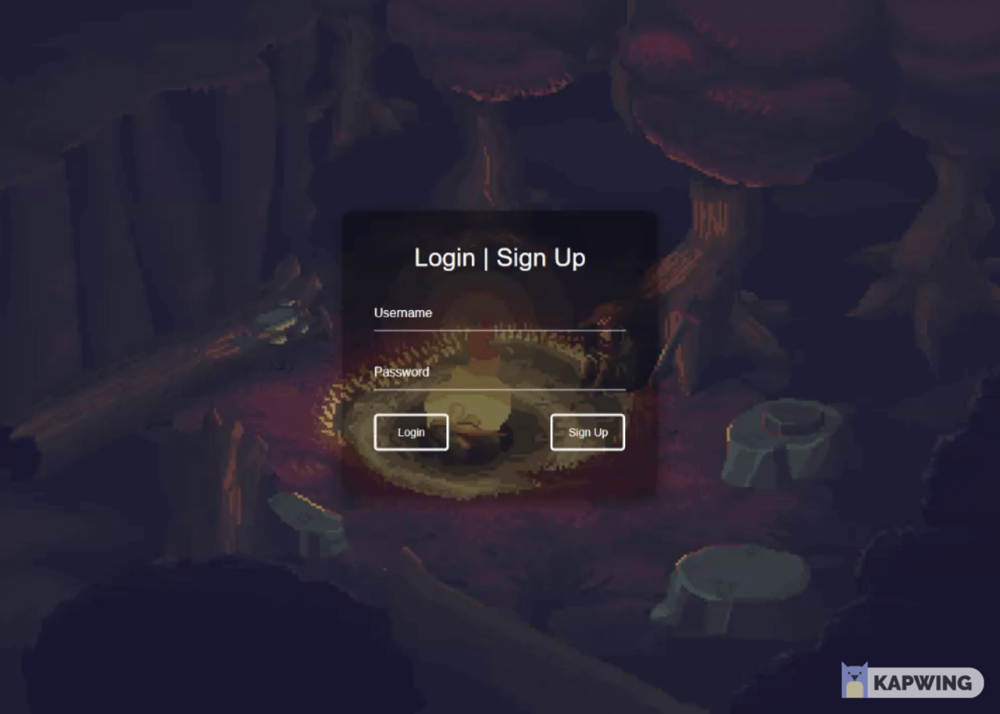
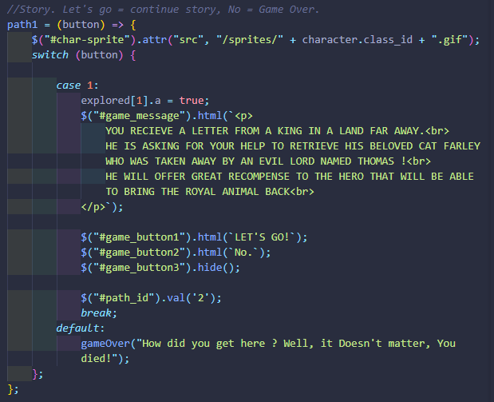
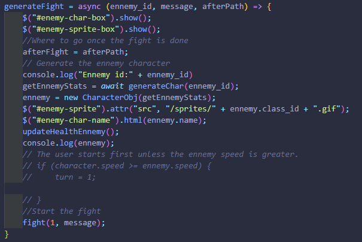
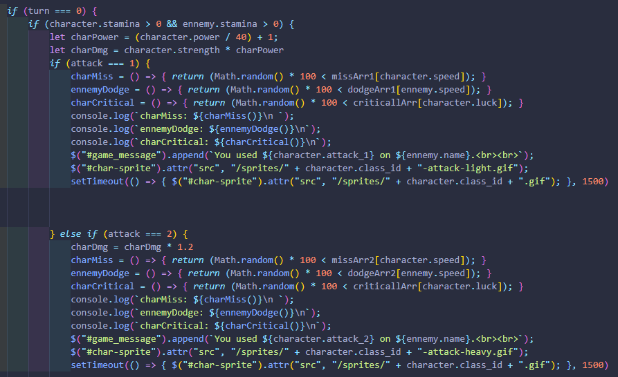
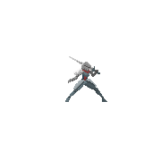
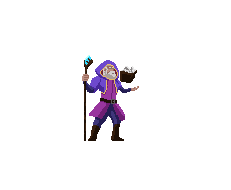
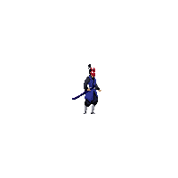

 

# FarQuest

**Welcome to FarQuest** 
A role-playing game of medieval fantasy. Select from a hero class of Knights, Wizards, Huntresses, or be an Assassin. Explore a rich world of story-telling, battles, and surprises as you journey to see the King. He's asked for your help and you fear you're running out of time.

A letter arrived, it's from the King... he's asking for your help. You set off to the castle to speak with the King but you discover your journey there is frought with obstacles. Indeed, something is stirring in the kingdom and your haste quickens. When you arrive at the castle, you discover that there is nary a soul nor sound in the streets and you begin to investigate.
 
 

[Click here to play FarQuest!](https://farquest.herokuapp.com/)
 
 

## Table of Contents

1. [Technology](#technology)
2. [Usage & Features](https://github.com/cheng21tang/Project-2/tree/models#usage--features)
3. [Game Mechanics]()
4. [License](#license)
5. [Contributing](#contributing)
6. [Questions](#questions)

 

 

## Technology

 &nbsp;
 &nbsp;
 &nbsp;
 &nbsp;
 &nbsp;
 &nbsp;
 &nbsp;
 &nbsp;
 &nbsp;
 &nbsp;
 &nbsp;
 &nbsp;
 &nbsp;
  

Here is a shortlist of technologies and tools used to build this game.

- HTML
- CSS
- JavaScript
- [Bootstrap](https://getbootstrap.com/)
- [jQuery](https://jquery.com/)
- [jQueryUI](https://jqueryui.com/)
- [Node.js](https://nodejs.org/en/)
- [npm](https://www.npmjs.com/) packages
    - [express](https://www.npmjs.com/package/express)
    - [express-session](https://www.npmjs.com/package/express-session)
    - [bcrypt](https://www.npmjs.com/package/bcrypt)
    - [mysql2](https://www.npmjs.com/package/mysql2)
    - [sequelize](https://www.npmjs.com/package/sequelize)
    - [connect-session-sequelize](https://www.npmjs.com/package/connect-session-sequelize)
    - [dotenv](https://www.npmjs.com/package/dotenv)
    - [RPGUI](https://github.com/RonenNess/RPGUI)
- [MySQL](https://www.mysql.com/)
- [HEROKU](https://www.heroku.com/)

Please visit the links above to learn more.

 

## Usage & Features

**HomePage** 
Create an account or sign-up to begin. You'll be taken to the character creation page if it is your first time.
  

**Character creation** 
You have a choice between 4 characters.

- Knight
- Wizard
- Huntress
- Assassin

Each character class has their own unique set of attributes that effect the stamina, strength, power, speed, luck, and their own set of attacks.

  

**Profile** 
On your profile page, you can see all the characters on your account. You can create new characters, delete old ones, or start a game by clicking on your character.

  

**Adventure Mode** 
When you start a game you'll be taken into adventure mode where the story begins. Your character is given choices and will effect the events in the storyline.

  

**Battle** 
You will encounter enemies in a turn-based fight. Your attacks and defense are calculated from your characters attributes. Keep an eye on your health bar and you trade attacks with the enemy.

  

**Chest & Items** 
You may find treasures in your journey, what surprises lie inside.

<---GIF OF CHEST HERE--->

 

## Game Mechanics

**Storyline paths** 
Diverging paths for the storyline created complexity in the client-side JavaScript.

  

**Battle - instances** 
Generating a battle instance during the story line, we fetch the enemy.id and render them to the HTML page.
 
*(Please see **/public/js/character.js** to review the code in more detail: **generateFight(); on line 162**)*
  

**Battle - fight mechanics** 
Here you can see the some of the factors we're taking in during each turn and action. We calculated the turn-based fight taking in the characters attributes and mixing in RNG. This effects the damange output, defense, chance to miss, etc.

 
*(Please see **/public/js/character.js** to review the code in more detail: **fight(); on line 190**)*
  

 

## License

MIT License

Copyright (c) 2021 Cheng Tang, Liam Stewart, and Dylan Couzon

Permission is hereby granted, free of charge, to any person obtaining a copy
of this software and associated documentation files (the "Software"), to deal
in the Software without restriction, including without limitation the rights
to use, copy, modify, merge, publish, distribute, sublicense, and/or sell
copies of the Software, and to permit persons to whom the Software is
furnished to do so, subject to the following conditions:

The above copyright notice and this permission notice shall be included in all
copies or substantial portions of the Software.

THE SOFTWARE IS PROVIDED "AS IS", WITHOUT WARRANTY OF ANY KIND, EXPRESS OR
IMPLIED, INCLUDING BUT NOT LIMITED TO THE WARRANTIES OF MERCHANTABILITY,
FITNESS FOR A PARTICULAR PURPOSE AND NONINFRINGEMENT. IN NO EVENT SHALL THE
AUTHORS OR COPYRIGHT HOLDERS BE LIABLE FOR ANY CLAIM, DAMAGES OR OTHER
LIABILITY, WHETHER IN AN ACTION OF CONTRACT, TORT OR OTHERWISE, ARISING FROM,
OUT OF OR IN CONNECTION WITH THE SOFTWARE OR THE USE OR OTHER DEALINGS IN THE
SOFTWARE.

 

## Musics

All Musics are free of charge, but all copyrights vest with YouFulca.
- [Link](https://wingless-seraph.net/en)

 

## Contributing

Future development opportunites:
- Story path model to be stored in database. Adds flexiblility and reduces lines of code.
- Additional classes, secondary character attribute like mana, rage, etc.
- Provide starter points during character creation for user to distribute
- Leveling system
- More inventory items!
- Equippable items; armor, swords, shields, etc.

We are gamers at heart and this is our first game built together and it was such a great learning experience of all the inner workings of a game of this scope. Then we started to think of the magnitude of our favorite games of the past and the effort and planning it takes to build those. Wow!

If you'd like to contribute, please fork this repository and submit pull request for the features above or other features you'd like to see in the game. We will review it for acceptance.

 

## Contact Us

Please feel free to reach out to us to talk about the game or check out our other individual works.

Liam Stewart
- [liamchristopher.media@gmail.com](mailto:liamchristopher.media@gmail.com)
- [GitHub](https://github.com/LiamStewart8)
- [LinkedIn](https://www.linkedin.com/in/liamsctewart/)

 
 
 

Dylan Couzon
- [dylancouzon@gmail.com](mailto:dylancouzon@gmail.com)
- [GitHub](https://github.com/Dylancouzon)
- [LinkedIn](https://www.linkedin.com/in/dcouzon/)

 
 
 

Cheng Tang
- [cheng21tang@gmail.com](mailto:cheng21tang@gmail.com)
- [GitHub](https://github.com/cheng21tang)
- [LinkedIn](https://www.linkedin.com/in/cheng21tang/)
